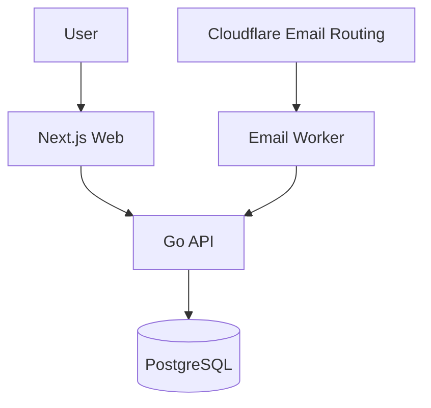

# Architecture

## MVP Boundaries

- One owned domain with catch-all routing.
- API-generated aliases such as `u7f3k@example.com`.
- Worker stores sender, subject, body excerpt, recipient alias, and detected OTP.
- UI displays the address and latest code.

## Later Extensions

- Add authenticated users and ownership checks.
- Add labels/groups for operational batches.
- Add provider-specific OTP rules in `apps/api/app/otp.py` and `apps/worker/src/index.ts`.
- Archive raw RFC822 messages to R2 if long-term audit storage is required.
